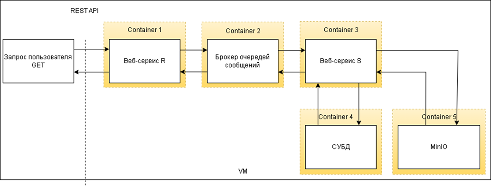

Инструкция по запуску:
- скачать проект
- запустить docker-compose.yml
- http://localhost:9020/swagger-ui/index.html
- в админке keycloak созданы 2 пользователя:
- login: user | password: user / стандартные права доступа
- login: admin | password: admin / расширенные права доступа

Схема сервиса:
